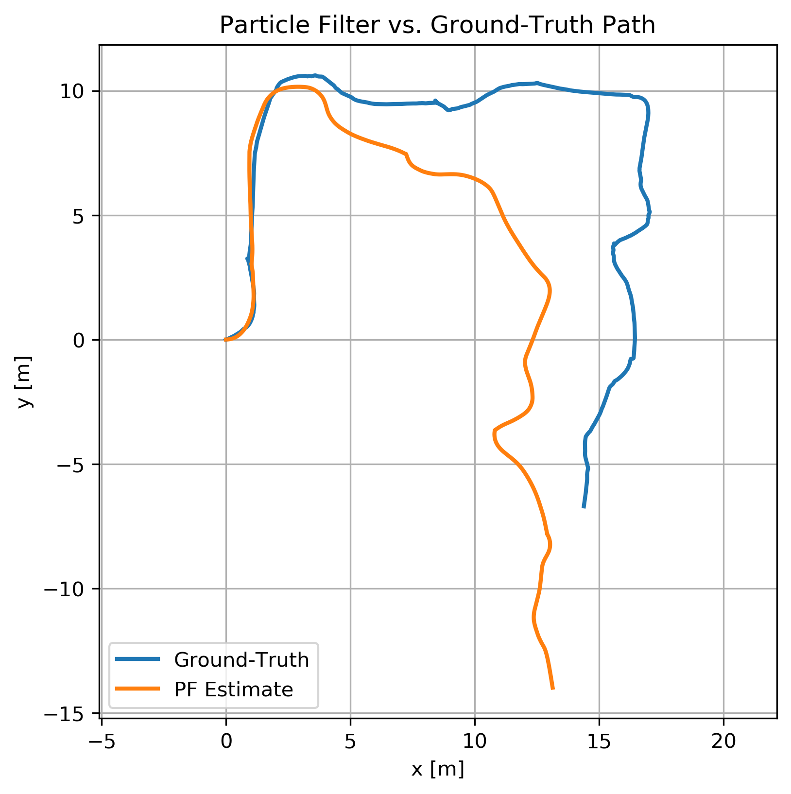

Particle Filter Localization

This repository contains my **ROS Noetic** implementation of Monte‑Carlo Localization (MCL) for Husky with retro‑reflector landmarks.

> **Author:** Tuğcan  
> **Workspace:** `~/robotlar_ws`

---

## 1 . Workspace setup

```bash
# clone / copy the package
cd ~/robotlar_ws/src
# (copy the particle_pf folder here)

# build everything
cd ~/robotlar_ws
catkin_make -j$(nproc)
source devel/setup.bash
```

### Dependencies

- ROS Noetic, Gazebo11
- `tf`, `rosbag`, `rviz`
- Python 3 (`pandas`, `matplotlib`) for analysis scripts

---

## 2 . Running the localization

```bash
roslaunch particle_pf pf_localization.launch \
  bag:=/absolute/path/to/hw3.bag \
  scan:=/front/scan \
  cmd_vel:=/husky_velocity_controller/cmd_vel \
  gt_topic:=/gazebo/model_states
```

The launch file

- loads **500 particles** (`num_particles`)
- reads parameters from **`config/params.yaml`**
- plays the bag file with simulated time
- publishes a static TF that aligns `map` with Gazebo `world`.

### RViz quick‑start

1. `rviz &`  
   2. **Fixed Frame** → `map`  
   3. *Add → By Topic*
   - `/pf/pf_particles` → MarkerArray
   - `/pf/pf_path` → Path
   - `/front/scan` → LaserScan

Bag file processed and checked on Rviz


For images use python code stored in results folder. You can use: python3 plot_results.py

Also you can start package with like this too:

roslaunch particle_pf pf_localization.launch bag:=/home/tugcan/robotlar_ws/src/particle_pf/bag/hw3.bag gt_topic:=/gazebo/model_states

---

## 3 . Code highlights

| File                                    | Purpose                                               |
| --------------------------------------- | ----------------------------------------------------- |
| `src/particle_filter_node.cpp`          | ROS glue: subscribes & publishes                      |
| `src/motion_model.cpp`                  | Velocity‑motion model (with `PF_DT_SCALE`, `V_SCALE`) |
| `src/sensor_model.cpp`                  | Range‑bearing likelihood, `BEARING_OFF`               |
| `include/particle_pf/reflector_map.hpp` | 11‑tower reflector map                                |
| `scripts/plot_results.py`               | Generates CSV statistics & path plot                  |

### `plot_results.py`

```python
tr = pd.read_csv('results/trace.csv')
err = pd.read_csv('results/errors.csv')

plt.plot(tr.x_gt, tr.y_gt, label='Ground‑Truth')
plt.plot(tr.x_est, tr.y_est, label='PF Estimate')
...
```

Produces **`results/path_compare.png`** shown below.


---

## 4 . Results

| Metric            | Mean  | Std Dev |
| ----------------- | ----- | ------- |
| **trans_err** (m) | 11.57 | 8.00    |
| **rot_err** (rad) | 0.44  | 0.32    |

Detailed:
| Statistic | **trans_err** (m) | **rot_err** (rad) |
|-----------|-------------------|-------------------|
| **Count** | 16,733 | 16,733 |
| **Mean** | 11.57 | 0.44 |
| **Std Dev** | 8.00 | 0.32 |
| **Min** | 0.0005 | 0.0000 |
| **25%** | 4.97 | 0.16 |
| **50%** | 8.77 | 0.38 |
| **75%** | 19.57 | 0.69 |
| **Max** | 27.16 | 1.23 |

> Computed over 16 733 samples (see `errors.csv`).

Initial 12 m segment after tuning:



I tried to perfect the mapping but I didn't solve it perfectly it changes very different translation after a time. But start location and first iterations are good.

## 5 . Folder structure

```
particle_pf/
 ├── launch/
 │   └── pf_localization.launch
 ├── config/
 │   └── params.yaml
 ├── src/
 │   ├── motion_model.cpp
 │   ├── sensor_model.cpp
 │   └── ...
 ├── include/particle_pf/
 │   └── reflector_map.hpp
 ├── results/          # CSV + plots
 └── scripts/
     └── plot_results.py
```

Note: I have deleted bag file in the bag folder because of the size but you can add it there.
